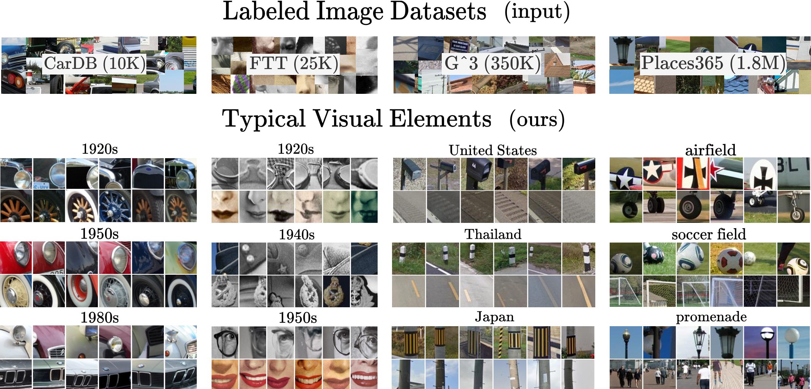

# Diffusion Models as Data Mining Tools

Official PyTorch implementation of [Diffusion Models as Data Mining Tools](https://imagine.enpc.fr/~ioannis.siglidis/diff-mining).  

**Authors**: [Ioannis Siglidis^1](https://imagine.enpc.fr/~siglidii/), [Aleksander&nbspHołyński^2](https://holynski.org/), [Alexei A. Efros^2](https://people.eecs.berkeley.edu/~efros/), [Mathieu Aubry^1](https://imagine.enpc.fr/~aubrym/), [Shiry Ginosar^2](https://people.eecs.berkeley.edu/~shiry/)

1. _LIGM, Ecole des Ponts, Univ Gustave Eiffel, CNRS, Marne-la-Vallée, France_  
2. _University of California, Berkeley_

## Introduction 
Our approach allows you to take a large labelled input dataset, and mine the patches that are important for each label.
It involves three steps: 
1. First you finetune Stable-Diffusion v1.5 with its standard loss $L_t(x, \epsilon, c)$ with prompts of the form $\text{"An image of Y"}$ (where Y is your label) in your custom dataset.  
2. For a sample of your input data you want to analyze, you then compute typicality $\mathbf{T}(x|c) =  \mathbb{E}_{\epsilon,t}[L_t(x, \epsilon, \varnothing) - L_t(x, \epsilon, c)]$ for all images.
3. You extract the top-1000 patches according to $\mathbf{T}(x | c)$ and then you cluster them using DIFT-161 features (ranking clusters according to median typicality of their elements).

### Installation 🌱
Our codebase is mainly developed on [diffusers](https://github.com/huggingface/diffusers/) implementation of [LDMs](https://arxiv.org/abs/2112.10752).
```bash
conda create -f environment.yaml
conda activate diff-mining
```

### Data
We show our results on 3 different types of data: cars ([CarDB]()), faces ([FTT](https://facesthroughtime.github.io/)) and street-view images ([G^3](https://arxiv.org/abs/2211.15521)).

- A properly extracted version of CarDB can be found [here]() and can be downloaded with:
```bash
source scripts/download-cardb.sh
```
- FTT you can request access for downloading the dataset in the [original project page](https://facesthroughtime.github.io/).: 
- G^3 is unfortunately proprietary but information about PanoramaIDs can be found on the [original repo](https://github.com/g-luo/geolocation_via_guidebook_grounding).

### Models
We share our models on huggingface which you can access through the handles:
- `diff-mining/g3`
- `diff-mining/cardb`
- `diff-mining/ftt`
- `diff-mining/xray`

or download them locally using:
```bash
source scripts/download-models.sh
```

## Approach

A full walkthrough of the pipeline can be seen in scripts: `scripts/training.sh` and `scripts/typicality.sh`.
- Code for finetuning models can be found under: `diffmining/finetuning/`.
- Code for computing typicality can be found at: `diffmining/typicality/compute.py`.
- Code for averaging typicality across patches, computing DIFT features and clustering can be found at: `diffmining/typicality/cluster.py`

### Applications

We test our typicality measure in two different approaches which we properly discuss in our paper.

#### Clustering of Translated Visual Elements
Using our diffusion model, we can translate each image, e.g. in the case of geography, from one country to another.
We use [PnP](https://arxiv.org/abs/2211.12572) which is the only method we found that was relatively robust in keeping a consistency between translated objects (i.e., windows would remain windows).
You can launch this translation by running:
```bash
source scripts/parallel.sh translate
```

Afterwards you need to compute typicality for all elements:
```bash
source scripts/parallel.sh compute
```

and then cluster them using:
```bash
source scripts/parallel.sh cluster
```

#### Emergent Disease Localization in X-rays
As typicality is connected to a binary classifier of the conditional vs the null conditioning, it can be used to "spatialize" information related to the condition on the input image.
We test this on X-ray images and show how typicality is improved after finetuning. To reproduce our results and evaluations run:
```bash
source scripts/xray.sh
```

### Citing 💫

```bibtex
@article{diff-mining,
    title = {},
    author = {},
    journal = {},
    year = {},
  }
```

### Acknowledgements
We would like to thank Grace Luo for data, code, and discussion; Loic Landreu and David Picard for insights on geographical representations and diffusion; Karl Doersch, for valuable advice; Sophia Koepke for feedback on our manuscript. pOur work, was supported by the HPC resources of IDRIS under the allocation AD011012905R1, AD011012905R2 made by GENCI.